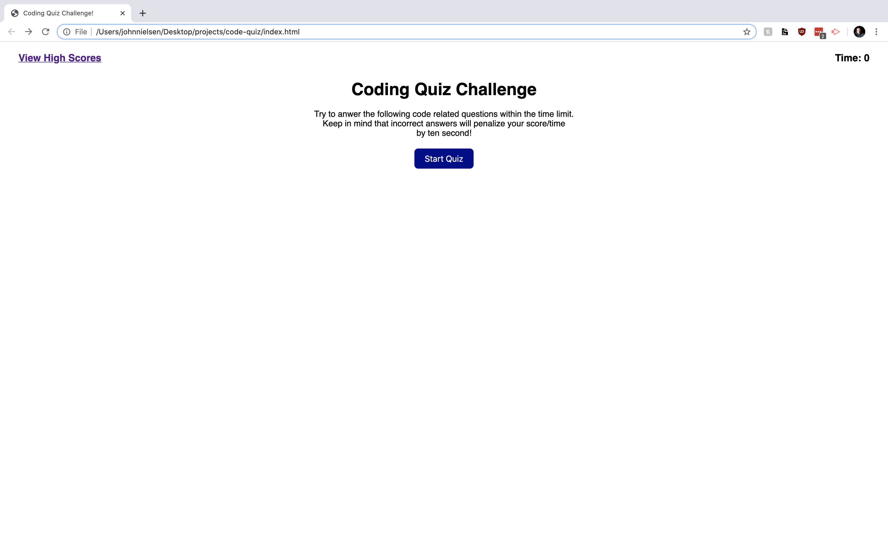

# Code Quiz
>A program to generate questions about coding.

## Table of contents
* [General info](#general-info)
* [Functionality](#functionality)
* [Screen Shots](#screenshots)
* [Status](#status)
* [Link](#link)
* [Contact](#contact)

## General info
This quiz will generate questions about coding (or anything else you wanted it to be about) and give you a score at the end based on how much time is left.

## Functionality
Clicking the Start Quiz button will populate the timer with 120 seconds and generate the first questions. Answering the question correctly will generate the next question while giving you a "Correct!" prompt underneath the question. Answering the questions wrong will deduct 20 seconds from your time as a penalty, generate the next questions, and give you a "Wrong!" prompt.

After you run out of time or you have answered all the questions, you will be asked to give your intials to put your score on the HighScores page. Clicking submit will send your initls and score to local storage, and take you to the highscores page where you will be able to see your other scores that are pulled from your local storage.

You can then either go back to the start of the quiz to try again, or you will have the option to clear the highscores.

## Screenshots

## Status
Project is: _complete_ (for now)

## Links
Live Page Link - https://johnnielsen1221.github.io/password-generator/
Respository Link - https://github.com/JohnNielsen1221/password-generator

## Contact
Created by John Hayes Nielsen - johnhayesnielsen@gmail.com